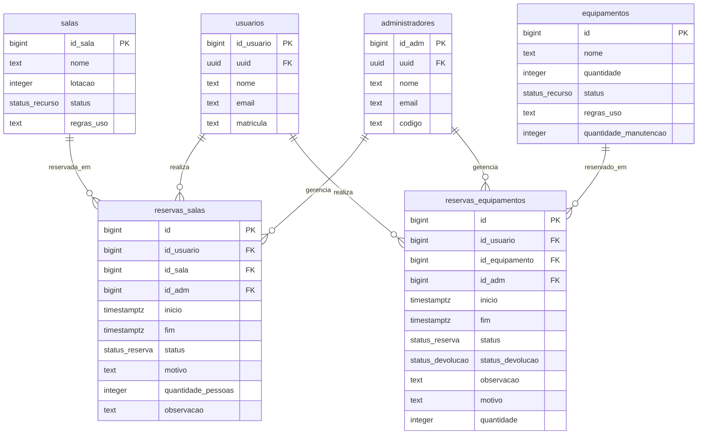

# AgendaLab — Frontend (React + Supabase)

MVP do sistema de reserva de laboratórios e equipamentos compartilhados, implementado **apenas no front-end**, consumindo diretamente o Supabase (Auth + Postgres + RLS) do projeto `gmtvpqcknqkqtzvdfyco`.

## ⚠️ Antes de rodar: aplique o SQL novo

O fluxo de **pré-cadastro pelo administrador** (aluno e outro admin) depende de 4 funções que ainda não existem no seu banco, mais uma correção na trigger de migração (ela criava a conta mas nunca apagava o registro temporário do schema `private`, permitindo reativação duplicada da mesma matrícula/código). Rode o arquivo:

```
supabase/sql/funcoes_pre_cadastro.sql
```

inteiro no **SQL Editor** do Supabase antes de usar o app. Ele cria:

- `admin_criar_pre_cadastro_usuario(nome, email, matricula)` — admin pré-cadastra aluno
- `admin_criar_pre_cadastro_admin(nome, email)` — admin pré-cadastra outro admin (gera o código)
- `admin_listar_pre_cadastros()` — lista pendentes de ativação
- `admin_cancelar_pre_cadastro(tipo, email)` — cancela um pré-cadastro
- corrige `private.handle_new_user()` para apagar o registro `private.pre_*` após a migração
- (opcional, recomendado) `EXCLUDE CONSTRAINT` via `btree_gist` em `reservas_salas`/`reservas_equipamentos`, para bloquear sobreposição de horário **no banco**, não só no front

Todas usam `SECURITY DEFINER` + `is_admin()`, então só funcionam para quem já é administrador — condizente com as RLS que você definiu.

### 🗑️ Exclusão de Conta e Anonimização de Dados (LGPD/Privacidade)

Para habilitar a exclusão atômica de conta no Supabase (que cancela reservas futuras ativas, limpa notificações, anonimiza dados cadastrais e remove o usuário de `auth.users`), execute o arquivo:

```
supabase/sql/exclusao_conta.sql
```

Ele cria a RPC `public.excluir_minha_conta()`, que é executada pelo próprio usuário autenticado de forma segura (`SECURITY DEFINER`). Caso ainda não tenha sido rodado, o front-end possui um fallback automático para realizar os cancelamentos e a anonimização.

## Stack

React 19 + TypeScript + Vite · Tailwind CSS v4 · React Router · `@supabase/supabase-js` · Recharts

## Modelo de Dados (DER)

Este diagrama representa o modelo de dados e relacionamentos do banco de dados (Supabase/PostgreSQL) para o AgendaLab:



## Como rodar

```bash
npm install
npm run dev
```

Credenciais do Supabase (`anon` key) já em `.env`.

## Fluxo de cadastro (schema `private` + trigger)

1. **Admin pré-cadastra** a pessoa (página `/admin/usuarios`): aluno → nome/email/matrícula; outro admin → nome/email (código gerado automaticamente e mostrado em tela para você repassar). Isso grava em `private.pre_usuarios`/`private.pre_administradores`, invisível na API pública.
2. **A pessoa ativa o próprio acesso** na tela de login (`/login`, abas "ativar (aluno)" / "ativar (admin)"): informa nome, e-mail, matrícula/código e cria uma senha.
   - O front primeiro chama `validar_pre_cadastro_usuario`/`validar_pre_cadastro_admin` (RPC) para checar elegibilidade antes mesmo de criar a conta no Auth — evita erro genérico do GoTrue.
   - Depois chama `supabase.auth.signUp(...)` com `matricula`/`codigo` nos metadados.
   - A trigger `private.handle_new_user()` valida de novo (defesa em profundidade), cria a linha em `public.usuarios`/`public.administradores` com `uuid = auth.uid()`, e apaga o registro `pre_*`.
3. **Login normal** depois disso, com e-mail/senha.

## RBAC (papel do usuário)

Não existe coluna "role": o papel é resolvido chamando a função `is_admin()` via RPC (funciona independente de RLS, é `SECURITY DEFINER`). Se `true`, o perfil vem de `administradores` filtrando por `uuid = auth.uid()`; senão, de `usuarios`. Os IDs numéricos internos (`id_usuario`/`id_adm`, usados nas FKs das reservas) vêm de `get_my_user_id()` (RPC) ou da própria linha de `administradores`.

## Regras de reserva implementadas

- **Bloqueio por status do recurso** (`RecursoAgenda.tsx`): se a sala/equipamento estiver `ocupado` ou `manutencao`, a grade de horários nem aparece — mostra um aviso e não permite solicitar reserva, independentemente do horário.
- **Lotação de sala**: ao reservar uma sala, o formulário pede a quantidade de pessoas; se exceder a `lotacao` cadastrada, o botão de confirmar fica desabilitado e aparece o aviso.
- **Conflito de horário**: checagem client-side antes do insert + tratamento do erro `23P01` (caso a `EXCLUDE CONSTRAINT` do item 6 do SQL esteja aplicada).

## Área do Usuário & Perfil

- `/perfil` — Exibição dos dados cadastrais (nome, e-mail, papel, matrícula/código de admin), identificador de conta e **Zona de Perigo** para exclusão de conta.
  - Alerta transparente sobre reservas futuras ativas (pendentes ou aprovadas) que serão canceladas.
  - Confirmação explícita de segurança (digitação de "EXCLUIR").
  - Cancelamento automático de reservas futuras ativas.
  - Anonimização/remoção dos dados pessoais e desativação definitiva da conta.
  - Encerramento imediato da sessão e feedback visual no login.

## Painel do administrador

- `/admin/recursos` — CRUD de salas/equipamentos (nome, capacidade/quantidade, status)
- `/admin/aprovacoes` — fila de solicitações pendentes, com **aviso visual em tempo real** (Supabase Realtime nas tabelas `reservas_salas`/`reservas_equipamentos`) quando chega uma nova solicitação ou uma reserva muda de status
- `/admin/reservas` — visão geral de **todas** as reservas (qualquer status), com filtro por tipo/status
- `/admin/usuarios` — pré-cadastro de alunos/administradores + lista de pendentes e contas ativas
- `/admin/dashboard` — métricas (reservas concluídas por semana, % de ocupação por recurso)

## Removido nesta versão

A aba **Planos/Monetização simulada** foi retirada do app, conforme solicitado.

## Observação sobre RLS pública em reservas

As políticas de `SELECT` em `reservas_salas`/`reservas_equipamentos` são `TO public USING (true)` — ou seja, tecnicamente **todas as colunas** ficam acessíveis via API para qualquer pessoa, autenticada ou não (RLS filtra linhas, não colunas). O front segue a mitigação que vocês já haviam documentado: na agenda pública/geral, só pede `inicio, fim, status` nas consultas; motivo/observações completos só aparecem em "Minhas reservas" (dono) e nas telas de admin. Isso reduz a exposição na prática, mas não é uma garantia de banco — se quiser bloquear de verdade o acesso a colunas sensíveis para terceiros, isso exigiria uma `view` pública restrita + revogar `SELECT` direto na tabela para `anon`/`authenticated` "comuns", o que eu posso preparar se quiser.
