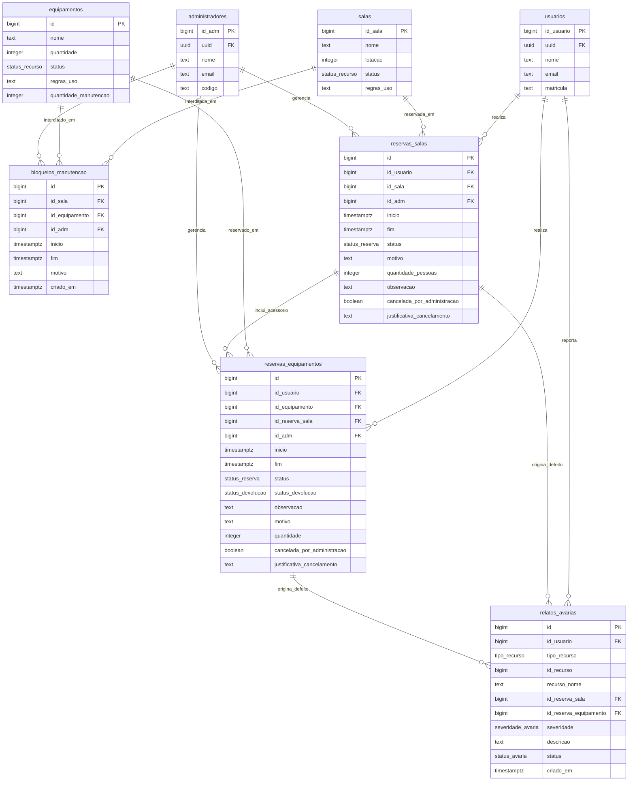

# ReserveAi — Frontend (React + Supabase)

MVP do sistema de reserva de laboratórios e equipamentos compartilhados, implementado **apenas no front-end**, consumindo diretamente o Supabase (Auth + Postgres + RLS) do projeto `gmtvpqcknqkqtzvdfyco`.

## ⚠️ Antes de rodar: aplique o SQL novo

O fluxo de **pré-cadastro pelo administrador** (aluno e outro admin) depende de 4 funções que ainda não existem no seu banco, mais uma correção na trigger de migração (ela criava a conta mas nunca apagava o registro temporário do schema `private`, permitindo reativação duplicada da mesma matrícula/código). Rode o arquivo:

```
supabase/sql/funcoes_pre_cadastro.sql
```

inteiro no **SQL Editor** do Supabase antes de usar o app. Ele cria:

- `admin_criar_pre_cadastro_usuario(nome, email, matricula)` — admin pré-cadastra aluno
- `admin_criar_pre_cadastro_admin(nome, email)` — admin pré-cadastra outro admin (gera o código)
- `admin_listar_pre_cadastros()` — lista pendentes de ativação
- `admin_cancelar_pre_cadastro(tipo, email)` — cancela um pré-cadastro
- corrige `private.handle_new_user()` para apagar o registro `private.pre_*` após a migração
- (opcional, recomendado) `EXCLUDE CONSTRAINT` via `btree_gist` em `reservas_salas`/`reservas_equipamentos`, para bloquear sobreposição de horário **no banco**, não só no front

Todas usam `SECURITY DEFINER` + `is_admin()`, então só funcionam para quem já é administrador — condizente com as RLS que você definiu.

### 🗑️ Exclusão de Conta e Anonimização de Dados (LGPD/Privacidade)

Para habilitar a exclusão atômica de conta no Supabase (que cancela reservas futuras ativas, limpa notificações, anonimiza dados cadastrais e remove o usuário de `auth.users`), execute o arquivo:

```
supabase/sql/exclusao_conta.sql
```

Ele cria a RPC `public.excluir_minha_conta()`, que é executada pelo próprio usuário autenticado de forma segura (`SECURITY DEFINER`). Caso ainda não tenha sido rodado, o front-end possui um fallback automático para realizar os cancelamentos e a anonimização.

### ⚡ Prevenção de Concorrência e Bloqueio de Cliques Simultâneos (US09 / RF04)

Para garantir que cliques simultâneos nunca gerem reservas duplicadas de salas ou estouro de estoque de equipamentos, execute no SQL Editor do Supabase:

```
supabase/sql/prevencao_concorrencia.sql
```

Ele ativa:
- **Pessimistic Locking (`FOR UPDATE`)** nas tabelas de recursos (`salas` e `equipamentos`) para serializar transações no mesmo milissegundo.
- **Triggers `BEFORE INSERT OR UPDATE`** em `reservas_salas` e `reservas_equipamentos` que impedem sobreposição de intervalos em reservas ativas (`pendente` e `aprovada`), lançando a mensagem de erro padronizada:
  `"Este horário acabou de ser reservado por outro usuário. Por favor, escolha outro período."`
- **Exclusion Constraint** (`reservas_salas_sem_sobreposicao`) via extensão `btree_gist` para integridade no motor de armazenamento.
- **RPC `solicitar_reserva`** para solicitação transacional com locks em nível de linha.
- **Sincronização Realtime** na tela de agendamento para atualização imediata dos horários ocupados.

Para que aprovações, recusas e cancelamentos atualizem a grade em tempo real, aplique também:

```text
supabase/sql/realtime_reservas.sql
```

O script inclui as duas tabelas de reservas na publicação `supabase_realtime`. A grade também atualiza ao voltar para a página e periodicamente enquanto ela estiver visível.

### 🛠️ Interdições por período

Para permitir que o responsável bloqueie uma sala ou equipamento em uma faixa de data/hora com justificativa pública, execute **depois** do script de prevenção de concorrência:

```text
supabase/sql/bloqueios_manutencao.sql
```

O script cria `bloqueios_manutencao`, aplica RLS (leitura pública e escrita somente pelo administrador autenticado), adiciona a tabela ao Realtime e substitui as triggers de reserva para rejeitar no banco qualquer intervalo que coincida com uma interdição. A proteção também vale para a RPC `solicitar_reserva` e para o fallback de inserção direta.

Depois, aplique a atualização que trata reservas já existentes:

```text
supabase/sql/migracao_cancelamento_reservas_manutencao.sql
```

Ela cria a RPC transacional `interditar_recurso_manutencao`. Quando há reservas pendentes ou aprovadas no intervalo, o painel mostra os usuários afetados e exige confirmação. Após a confirmação, a interdição é criada, as reservas são canceladas e os usuários recebem uma notificação com a justificativa. Se `bloqueios_manutencao.sql` já foi executado anteriormente, execute somente esta nova migração.

Para habilitar a ação de **Interdição Emergencial** por data e turnos, execute em seguida:

```text
supabase/sql/interdicao_emergencial.sql
```

A migração define os turnos manhã (07h–12h), tarde (12h–18h) e noite (18h–22h), cria a RPC transacional `interditar_recurso_emergencial` e registra em cada reserva a origem e a justificativa do cancelamento administrativo. Bloqueios, cancelamentos e alertas são gravados atomicamente; se qualquer etapa falhar, nenhuma alteração parcial é mantida.

### 🎒 Acessórios na reserva de sala

Para permitir que uma reserva de sala inclua projetores, kits didáticos e outros itens do acervo, aplique depois de todas as migrações de concorrência, manutenção e interdição emergencial listadas acima:

```text
supabase/sql/acessorios_reserva_sala.sql
```

A migração vincula as reservas de equipamento à sala, atualiza `solicitar_reserva` para criar todo o pedido em uma única transação e sincroniza aprovação ou cancelamento. As quantidades dos acessórios são contabilizadas pelas mesmas triggers de estoque das reservas avulsas, inclusive sob solicitações concorrentes.

### 👥 Validação de Lotação Máxima e Capacidade de Salas

Para garantir a segurança do laboratório e impedir reservas que ultrapassem a capacidade de ocupantes permitida no espaço, aplique:

```text
supabase/sql/validar_capacidade_sala.sql
```

A migração:
- Cria a trigger `trg_validar_lotacao_reserva_sala` em `public.reservas_salas` (`BEFORE INSERT OR UPDATE`), validando no banco de dados que a quantidade de ocupantes seja um número inteiro estritamente positivo e menor ou igual à `lotacao` cadastrada para a sala em `public.salas`.
- Caso exceda a capacidade, o banco de dados rejeita a operação com o erro: `"A lotação máxima permitida para este espaço é de X pessoas."`.
- Atualiza a RPC `solicitar_reserva` com validação de payload nativa pré-inserção.

### ⏱️ Teto Semanal de Horas em Recursos Concorridos

Para garantir oportunidades iguais para todos os alunos e impedir o monopólio de equipamentos escassos ou recursos concorridos, aplique:

```text
supabase/sql/teto_horas_semanal.sql
```

A migração:
- Cria a função `public.calcular_horas_semana_usuario` que calcula a soma das durações das reservas do aluno na semana vigente (segunda a domingo, via `date_trunc('week')`).
- Cria triggers `trg_validar_teto_semanal_reserva_equip` e `trg_validar_teto_semanal_reserva_sala` que impedem reservas ativas cujo somatório de horas semanais para o recurso ultrapasse a cota de **4 horas semanais por aluno**, rejeitando no banco com aviso explicativo.

### 🔁 Reservas semanais

Para habilitar a opção **Repetir semanalmente** no formulário, aplique depois das migrações de acessórios, capacidade e teto semanal:

```text
supabase/sql/reservas_semanais.sql
```

A RPC `solicitar_reservas_semanais` aceita uma data de término inclusiva, valida todas as ocorrências e grava de 2 a 52 reservas em uma única transação. Se houver conflito, manutenção, estoque insuficiente ou alguma validação existente falhar, nenhuma reserva da série é criada. Cada ocorrência segue o fluxo normal de aprovação e cancelamento.

### Vistoria de equipamentos na entrega e devolução

Depois de `acessorios_reserva_sala.sql`, aplique:

```text
supabase/sql/vistorias_equipamentos.sql
```

Na aba **Entrega e devolução** do painel de aprovações, o responsável registra cabo, peças e condição física de cada reserva de equipamento aprovada, inclusive acessórios de sala. A entrega exige os três itens confirmados. No retorno, qualquer ausência ou dano exige uma observação; a RPC registra a vistoria e marca a devolução na mesma transação. O histórico, com data e responsável, fica visível na reserva para o administrador e o solicitante. O relato de avaria feito pelo aluno continua disponível separadamente.

### ⚠️ Reporte de Defeitos e Avarias em Recursos Utilizados

Para permitir que alunos e pesquisadores reportem ocorrências, defeitos ou avarias logo após a utilização de uma sala ou equipamento, aplique:

```text
supabase/sql/relatos_avarias.sql
```

A migração:
- Cria os tipos enumerados `severidade_avaria` (`'leve'`, `'media'`, `'critica'`) e `status_avaria` (`'pendente'`, `'em_analise'`, `'resolvido'`).
- Cria a tabela `public.relatos_avarias` com vínculos para o usuário, recurso e reservas associadas.
- Aplica políticas RLS completas (usuários autenticados criam relatos e consultam os seus; administradores visualizam e gerenciam todos os relatos).
- Adiciona `public.relatos_avarias` à publicação `supabase_realtime` para envio de notificações imediatas ao painel e sininho do administrador.

## Stack

React 19 + TypeScript + Vite · Tailwind CSS v4 · React Router · `@supabase/supabase-js` · Recharts

## Modelo de Dados (DER)

Este diagrama representa o modelo de dados e relacionamentos do banco de dados (Supabase/PostgreSQL) para o ReserveAi:



## Como rodar

```bash
npm install
npm run dev
```

Credenciais do Supabase (`anon` key) já em `.env`.

## Fluxo de cadastro (schema `private` + trigger)

1. **Admin pré-cadastra** a pessoa (página `/admin/usuarios`): aluno → nome/email/matrícula; outro admin → nome/email (código gerado automaticamente e mostrado em tela para você repassar). Isso grava em `private.pre_usuarios`/`private.pre_administradores`, invisível na API pública.
2. **A pessoa ativa o próprio acesso** na tela de login (`/login`, abas "ativar (aluno)" / "ativar (admin)"): informa nome, e-mail, matrícula/código e cria uma senha.
   - O front primeiro chama `validar_pre_cadastro_usuario`/`validar_pre_cadastro_admin` (RPC) para checar elegibilidade antes mesmo de criar a conta no Auth — evita erro genérico do GoTrue.
   - Depois chama `supabase.auth.signUp(...)` com `matricula`/`codigo` nos metadados.
   - A trigger `private.handle_new_user()` valida de novo (defesa em profundidade), cria a linha em `public.usuarios`/`public.administradores` com `uuid = auth.uid()`, e apaga o registro `pre_*`.
3. **Login normal** depois disso, com e-mail/senha.

## RBAC (papel do usuário)

Não existe coluna "role": o papel é resolvido chamando a função `is_admin()` via RPC (funciona independente de RLS, é `SECURITY DEFINER`). Se `true`, o perfil vem de `administradores` filtrando por `uuid = auth.uid()`; senão, de `usuarios`. Os IDs numéricos internos (`id_usuario`/`id_adm`, usados nas FKs das reservas) vêm de `get_my_user_id()` (RPC) ou da própria linha de `administradores`.

## Regras de reserva implementadas

- **Bloqueio por status do recurso** (`RecursoAgenda.tsx`): se a sala/equipamento estiver `ocupado` ou `manutencao`, a grade de horários nem aparece — mostra um aviso e não permite solicitar reserva, independentemente do horário.
- **Manutenção programada por período**: o administrador escolhe o início e o fim da interdição e informa uma justificativa obrigatória. A faixa aparece destacada no calendário, impede novas solicitações e, após revisão, cancela e notifica reservas ativas que coincidam com o intervalo.
- **Interdição emergencial**: o administrador escolhe a data e um ou mais turnos (manhã, tarde e noite), informa uma justificativa pública e revisa os usuários afetados. Na confirmação, os períodos são bloqueados, todas as reservas ativas são marcadas como “Cancelada pela Administração” e os usuários recebem alertas automáticos — tudo na mesma transação.
- **Lotação máxima de sala**: o formulário de reserva exibe de forma visível a capacidade máxima permitida daquele recurso. O campo "Quantidade de pessoas / Ocupantes" aceita apenas números inteiros maiores que zero. Se o número informado for superior à capacidade da sala, o botão de submissão é desabilitado com o erro exato: *"A lotação máxima permitida para este espaço é de X pessoas."*, com validação dupla na interface e no banco de dados.
- **Justificativa obrigatória na recusa de reserva**: o painel de aprovações exige o preenchimento de uma justificativa formal ao recusar uma solicitação pendente, visível no histórico do usuário.
- **Teto semanal de horas em recursos concorridos**: O sistema contabiliza as horas agendadas pelo aluno na semana vigente (segunda a domingo). Se uma nova solicitação ultrapassar o teto configurado (máx. 4h semanais por recurso), o envio é imediatamente bloqueado no modal com aviso explicativo detalhando as horas já agendadas e a duração do pedido, com validação preventiva na interface e no banco de dados.
- **Reporte de defeito/avaria pós-uso**: Em reservas concluídas (`MinhasReservas.tsx`), o aluno visualiza o botão *"Reportar problema/avaria"*. Um modal permite selecionar a severidade (**Leve**, **Média**, **Crítica**) e detalhar a ocorrência. O envio dispara notificação imediata ao painel e sininho do administrador com atualização em tempo real.
- **Acessórios opcionais da sala**: o formulário lista somente itens com estoque disponível no período, permite escolher quantidades e envia sala + acessórios atomicamente. O histórico apresenta os itens vinculados em um único resumo.
- **Conflito de horário e cliques simultâneos**: Verificação pré-persistência em tempo real + bloqueio pessimista via locks/triggers e `EXCLUDE CONSTRAINT` (PostgreSQL `23P01`), garantindo que apenas a primeira requisição seja confirmada e o segundo usuário receba o aviso imediato: *"Este horário acabou de ser reservado por outro usuário. Por favor, escolha outro período."*

## Área do Usuário & Perfil

- `/perfil` — Exibição dos dados cadastrais (nome, e-mail, papel, matrícula/código de admin), identificador de conta e **Zona de Perigo** para exclusão de conta.
  - Alerta transparente sobre reservas futuras ativas (pendentes ou aprovadas) que serão canceladas.
  - Confirmação explícita de segurança (digitação de "EXCLUIR").
  - Cancelamento automático de reservas futuras ativas.
  - Anonimização/remoção dos dados pessoais e desativação definitiva da conta.
  - Encerramento imediato da sessão e feedback visual no login.

## Painel do administrador

- `/admin/recursos` — CRUD de salas/equipamentos (nome, capacidade/quantidade, status), manutenção programada por intervalo, interdição emergencial por data e turnos e trava de limite de salas do plano Grátis.
- `/admin/aprovacoes` — fila de solicitações pendentes, vistoria de entrega e devolução de equipamentos e **Aba de Avarias Reportadas**, com **notificação e atualização em tempo real** e ações para alterar status (Em análise, Resolvido).
- `/admin/reservas` — visão geral de **todas** as reservas (qualquer status), com filtro por tipo/status.
- `/admin/usuarios` — pré-cadastro de alunos/administradores com trava de limite de 1 administrador no plano Grátis.
- `/admin/dashboard` — métricas (reservas concluídas por semana, % de ocupação por recurso).
- `/admin/planos` — tela de gestão de planos (Grátis vs Premium R$ 19,90/mês) e simulação de upgrades/downgrades de assinatura (*Feature Gating*).

## Observação sobre RLS pública em reservas

As políticas de `SELECT` em `reservas_salas`/`reservas_equipamentos` são `TO public USING (true)` — ou seja, tecnicamente **todas as colunas** ficam acessíveis via API para qualquer pessoa, autenticada ou não (RLS filtra linhas, não colunas). O front segue a mitigação que vocês já haviam documentado: na agenda pública/geral, só pede `inicio, fim, status` nas consultas; motivo/observações completos só aparecem em "Minhas reservas" (dono) e nas telas de admin. Isso reduz a exposição na prática, mas não é uma garantia de banco — se quiser bloquear de verdade o acesso a colunas sensíveis para terceiros, isso exigiria uma `view` pública restrita + revogar `SELECT` direto na tabela para `anon`/`authenticated` "comuns", o que eu posso preparar se quiser.
